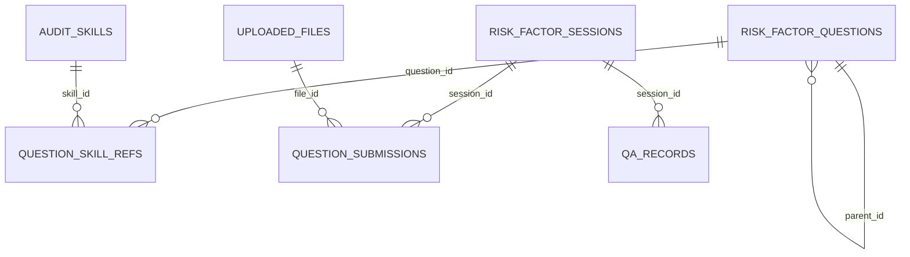
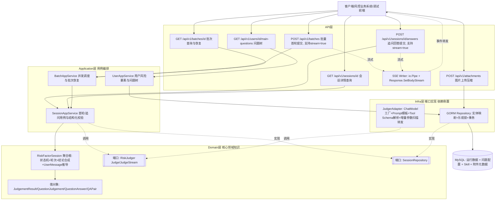
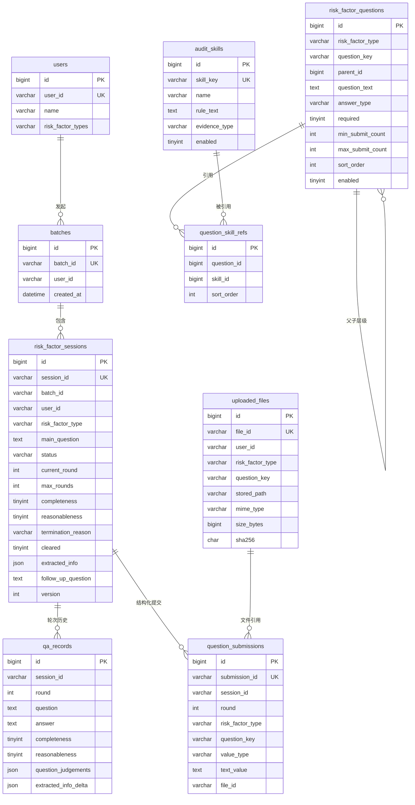

# 风险要素合理怀疑排除服务 — 技术设计方案

## 用户需求

基于 Eino（Go, CloudWeGo）构建“风险要素合理怀疑排除”服务，遵循DDD。批量处理一个用户名下多个风险要素（身份、资金来源、交易场景）；每个风险要素由group主问题和可配置子问题组成，用户按`question_key`提交结构化文本或图片答案，LLM对每个子问题分别判断**完整性**与**合理性**。若信息不完整，则针对缺失点生成追问，等待用户通过专门接口提交追问回答，每要素最多追问 3 次；一旦完整性满足即结束追问循环（不再因合理性问题继续追问），最终结合两个维度给出"是否排除合理怀疑"的结论、终止原因及提取到的结构化信息。

## 产品概览

面向风控/尽调场景：按统一问题配置批量提交身份、资金来源、交易场景等风险要素的结构化文本和图片答案；LLM根据问题关联的Skill逐项判断**完整性**（必填资料是否覆盖）与**合理性**（内容是否可信、一致、无明显篡改）。若信息不完整，则针对缺失点生成追问，等待用户通过专门接口提交追问回答，每要素最多追问 3 次；一旦完整性满足即结束追问循环（不再因合理性问题继续追问），最终结合两个维度给出"是否排除合理怀疑"的结论、终止原因及提取到的结构化信息。项目升级为**全栈**：后端提供标准化的 HTTP 接口契约（含流式响应能力）、数据层设计；前端提供一个轻量对话页面，用于开发调试上述批量提交/追问问答全流程（非面向最终业务用户的正式产品界面）。

**对用户可见的对话体验按会话与批次分层收敛**：用户提交回答后，前端先展示“正在分析中……”；单个风险要素仍需追问时，其`message`为缺失资料提示并支持真实逐字流式展示；单个风险要素终态仅更新内部状态，不单独显示完成气泡。若批次中同时存在已完成项和确需补充资料的项，前端才展示已完成项摘要；只有预期的全部风险要素结果到齐且均已终止时，才单独显示“审核结果将在3个工作日内推送给您”。

## 统一问题配置与证据审核

风险要素表单采用“风险要素 → `group`主问题 → 可回答子问题 → 审核Skill”结构。`risk_factor_questions`统一保存主问题和子问题：主问题的`answer_type=group`且不直接回答，子问题以风险要素内唯一的`question_key`标识，支持`text/image/file`、必填/选填、最少与最多提交数、排序和启停。`identity`、`fund_source`、`transaction_scene`分别配置身份、资金来源和交易场景资料。

`audit_skills`独立保存可运营审核规则，`question_skill_refs`支持问题与Skill多对多引用；LLM Prompt按引用顺序动态组合规则。Tool Calling返回`items[]`逐问题判断，领域层根据全部必填问题执行AND聚合，模型漏项按不完整处理，响应返回`missing_question_keys`和`question_judgements`。

结构化答案独立写入`question_submissions`；图片二进制保存于`storage.local_dir`，`uploaded_files`仅保存受控相对路径、归属、MIME、大小及SHA-256。上传接口先校验原始文件大小、扩展名、MIME和真实图片内容，再统一转换为JPEG并在必要时缩放、调整质量，确保压缩后不超过`storage.max_stored_image_bytes`（默认1MB）才落盘；数据库大小、MIME和SHA-256均以压缩后文件为准。`max_files_per_question`只限制当前一次答案引用的`file_ids`，不累计历史上传记录。Eino v0.9.13通过`Message.UserInputMultiContent`与`MessageInputImage.Base64Data`读取压缩后的落盘文件并传入模型；图片审核通过`llm.vision_provider: ark`分流到火山引擎 Ark OpenAI 兼容接口，使用豆包视觉模型，`ARK_API_KEY`仅从环境变量注入。

### 数据关系



迁移`0003_unify_risk_factor_questions`通过`INSERT ... SELECT`把旧`risk_factor_main_questions`迁为`group`节点，写入三类风险要素的子问题与Skill seed，随后删除旧表以避免双写；Down迁移先恢复旧主问题表再移除新增结构。迁移`0004_optional_multi_image_evidence`新增`max_submit_count`，并把资金来源、交易场景图片证据调整为选填且允许1–5张。

### 新版接口契约摘要

- `GET /api/v1/users/{user_id}/main-questions`：每项返回`main_question`及`questions[]`（`question_key/question_text/answer_type/required/min_submit_count/max_submit_count/sort_order`），不返回Skill规则。
- `POST /api/v1/attachments`：`multipart/form-data`字段为`user_id/risk_factor_type/question_key/file`，返回`file_id/original_name/mime_type/size_bytes`。
- `POST /api/v1/batches`：每个风险要素提交`answers: [{question_key,text? ,file_ids?}]`；文本与文件引用互斥。
- `POST /api/v1/sessions/{session_id}/answers`：追问使用同一`answers`结构；前端仅提交`missing_question_keys`对应问题。
- 同步会话响应和批次查询包含`missing_question_keys`与`question_judgements`；当前SSE `result`只包含会话核心状态、文案和提取信息，追问表单由流式文案及后续批次查询恢复。

## 核心功能

- 批量提交用户及多个风险要素的`answers[]`，各要素独立并发进行逐问题首轮判断
- 单个风险要素追问回答提交接口（按 session 定位，仅 Processing 状态可提交）
- 批次/会话状态与历史问答查询接口
- 完整性驱动追问循环（≤3轮），合理性仅参与终态结论合成、不驱动追问
- 结论合成规则：完整+合理→Cleared；完整+不合理→NotCleared(unreasonable)；达上限仍不完整→NotCleared(max_rounds_incomplete)；不完整且未达上限→继续追问
- 提取信息跨轮次累积合并（同名字段以最新轮次为准）
- 统一的 API 契约：响应包装格式、错误码体系、字段命名规范、鉴权方式
- 全过程持久化，业务状态机作为领域核心知识内聚在领域层，LLM调用与Prompt模板经依赖倒置下沉到基础设施层
- **流式输出**：批量首轮提交、追问回答提交两个触发LLM调用的接口支持以 SSE（Server-Sent Events）方式真正逐字流式展示"下一句对用户说的话"，默认仍保留同步JSON响应以兼容既有调用方
- **调试前端**：提供一个简单的单页对话调试页面，可视化发起批量问答、查看/输入追问、观察流式增量输出与最终结论，用于开发期功能验证
- **会话与批次文案分层**：`processing`会话的`message`为追问文本；单会话终态只更新内部状态。部分完成时显示完成项摘要；整个批次完成时仅显示“审核结果将在3个工作日内推送给您”

## 技术栈

- 语言：Go 1.26.4（以`go.mod`为准）
- LLM框架：CloudWeGo `eino` + `eino-ext`（ChatModel Provider可插拔适配，已支持 `mock`（本地/CI固定规则模拟）、`openai`（通用兼容协议）、`ark`（火山引擎 Ark OpenAI 兼容接口，负责图片审核）、`deepseek`（官方组件，负责文本审核））
- Web框架：Hertz（CloudWeGo同生态，高性能、原生流式支持，errgroup并发调用友好）
- ORM：GORM；数据库变更使用`migrations/*.up.sql`/`*.down.sql`顺序迁移（可由MySQL客户端或golang-migrate执行）
- 数据库：MySQL 8.x
- 配置：Viper
- 并发：golang.org/x/sync/errgroup
- 流式传输：SSE（`text/event-stream`），Handler通过`io.Pipe`与Hertz `Response.SetBodyStream`持续写出事件帧
- 前端（调试页面）：Vue 3 + TypeScript + Vite（轻量、组件化，便于管理多个风险要素并行对话卡片），开发态通过 Vite Dev Server 代理到后端；不引入状态管理框架/UI组件库，保持调试工具的最小依赖

## 架构风格：DDD + 端口与适配器（Hexagonal）

核心原则：**领域层零框架依赖，单风险要素状态机和单会话文案推导内聚在领域层；LLM调用与Prompt构建通过依赖倒置下沉到基础设施层。跨会话的批次展示由前端基于API结果聚合，不反向污染领域模型。**

### 分层说明

- **domain（领域层）**：`internal/domain/riskfactor/`。不 import eino、不 import gorm。包含：
  - 聚合根 `RiskFactorSession`：封装状态机全部规则（转移条件、轮次校验、终态判定、提取信息合并、**对外展示文案`UserMessage()`推导**），是"核心领域知识"载体，提供领域方法驱动状态迁移，不对外暴露可绕过规则的字段直接赋值。
  - 值对象：`JudgementResult`（含逐问题`Questions`和`MissingQuestions`）、`QuestionJudgement`、`QuestionAnswer`、`QAPair`、`RiskFactorType`、`SessionStatus`、`TerminationReason`。
  - 领域常量：`SessionCompletedMessage`用于单风险要素终态，`BatchClosingMessage`仅用于全部风险要素完成后的批次收尾。
  - 端口（domain定义，infra实现）：`RiskJudger`（LLM判断能力抽象）、`SessionRepository`（持久化能力抽象）。
  - 领域事件（可选，供审计）：`SessionCleared`/`SessionNotCleared`/`FollowUpRequested`。
- **application（应用层）**：编排批次、会话、用户问题树、附件归属和结构化答案校验；调用领域状态机并通过仓储端口落库。批次用`errgroup`并发处理风险要素；会话保存的数据库事务由仓储适配器封装。
- **infra（基础设施层）**：
  - `internal/infra/llm/`：ChatModel工厂（按provider分发eino-ext组件）、Prompt/ChatTemplate构建（系统提示词+风险要素类型+历史问答拼装）、结构化输出Tool Schema定义与解析重试、`JudgerAdapter`实现`domain.RiskJudger`（含基于增量Tool Call参数的追问文本真流式提取，详见"流式输出设计"）。
  - `internal/infra/persistence/`：GORM实体定义（与domain聚合做双向映射，不直接复用domain结构体）、实现`domain.SessionRepository`（含乐观锁+事务）。
- **api（接口层）**：`internal/api/`。Hertz路由、Handler、DTO，调用application层用例，不下沉业务逻辑；响应中的`message`字段直接取自`RiskFactorSession.UserMessage()`，api层不重复实现该推导规则；同时承载SSE流式响应的写出（详见"流式输出设计"章节）。
- **config/main**：配置加载 + `cmd/server/main.go` 手动依赖组装（infra实现→注入application→注入api handler），无需额外DI框架。
- **web（前端调试页面）**：独立HTTP客户端。除渲染`message/status`外，还使用`questions/missing_question_keys/question_judgements`构建动态表单和调试信息，并聚合全部会话状态决定批次级收尾文案。

依赖方向：api → application → domain(端口接口) ← infra(实现端口)。infra依赖domain定义的接口类型，domain完全不依赖infra，实现依赖倒置。web前端独立于后端分层，仅作为api层的HTTP客户端。

## 判断维度拆分与结论合成（核心业务规则，实现于domain聚合根）

- 每轮LLM判断同时输出 `completeness`（完整性）与`reasonableness`（合理性）两个独立bool，以及`follow_up_question`（针对完整性缺口生成，未终态时使用）、`extracted_info`（结构化，跨轮次以字段级合并、同名取最新轮次）。
- 追问循环仅由`completeness`驱动：completeness=false 且 round<3 → 生成追问、round+1、状态仍为Processing；completeness=true → 立即终止追问循环，不再看reasonableness决定是否继续追问。
- 终态结论合成规则（domain聚合根内实现）：
  - completeness=true & reasonableness=true → Cleared（cleared=true）
  - completeness=true & reasonableness=false → NotCleared（cleared=false，reason=unreasonable）
  - completeness=false & round已达3 → NotCleared（cleared=false，reason=max_rounds_incomplete）
  - completeness=false & round<3 → 非终态，继续Processing，携带follow_up_question
- **对外展示文案分层规则**：
  - `Status == Processing`（非终态） → `UserMessage()`返回本轮`follow_up_question`，提示具体需要补充的资料。
  - `Status ∈ {Cleared, NotCleared}` → 单会话响应保留`SessionCompletedMessage`语义供调用方识别，但前端只更新内部状态，不生成完成气泡。
  - 批次中仍有确认需要补充资料的风险要素时，前端可集中显示已完成项摘要；结果全部到齐且没有`processing/llm_error`时，只显示`BatchClosingMessage`（“审核结果将在3个工作日内推送给您”）。SSE终态单会话不发送收尾`message_delta`。

## 状态机设计（domain层聚合根RiskFactorSession内实现，非分散在application/api）

状态集合：Processing（含round 0~3）、Cleared（终态）、NotCleared（终态，含reason: unreasonable/max_rounds_incomplete）、LLMError（非终态、可重试、不消耗轮次）。
事件：SubmitInitialAnswer、SubmitFollowUpAnswer、LLM判断返回（携带completeness+reasonableness）、LLM调用/解析失败。

```mermaid
stateDiagram-v2
    [*] --> Processing: SubmitInitialAnswer(round=0)
    Processing --> LLMError: LLM调用/解析失败
    LLMError --> Processing: 重试同一轮(不增加round)
    Processing --> Cleared: completeness=true & reasonableness=true
    Processing --> NotCleared_Unreasonable: completeness=true & reasonableness=false
    Processing --> NotCleared_MaxRounds: completeness=false & round==3
    Processing --> Processing: completeness=false & round<3 (round+=1, 记录follow_up_question, 等待SubmitFollowUpAnswer)
    NotCleared_Unreasonable --> [*]
    NotCleared_MaxRounds --> [*]
    Cleared --> [*]

    state NotCleared_Unreasonable {
      note: cleared=false, reason=unreasonable, UserMessage()=SessionCompletedMessage
    }
    state NotCleared_MaxRounds {
      note: cleared=false, reason=max_rounds_incomplete, UserMessage()=SessionCompletedMessage
    }
```

仅 Processing 状态的session允许提交SubmitFollowUpAnswer；终态session再提交追问请求返回明确业务错误。状态、round、reason、completeness/reasonableness快照等字段在infra/persistence GORM实体中有对应映射，但状态迁移判断逻辑与`UserMessage()`推导逻辑只存在于domain层，infra/application只是读写字段或转发该方法的返回值，不做业务判断。

## Implementation Notes

- 日志：不打印用户回答原文全文，仅记录session_id/batch_id/round/status/耗时。
- LLM调用失败/解析失败：进入LLMError，允许同轮重试（不消耗round），最终仍失败需在响应中如实返回错误。
- 批量接口单要素失败不应导致整批失败，返回每要素独立status/error。
- “新增QA记录/结构化提交”与“更新session状态/轮次”由`GORMSessionRepository.Save`在同一GORM事务内完成，并通过乐观锁`version`检测并发更新。
- extracted_info合并逻辑（跨轮次字段级合并）应实现为domain值对象上的方法（如`JudgementResult.MergeInto(existing map)`），保持规则内聚。
- `message`字段不落库存储（终态文案是常量、非终态文案即已持久化的`follow_up_question`），`RiskFactorSession.UserMessage()`是基于已有字段（`Status`+最新`follow_up_question`）的**运行时推导**，避免数据冗余与不一致。

## 流式输出设计

### 目标与边界

`POST /api/v1/batches`和`POST /api/v1/sessions/{session_id}/answers`均支持`stream`开关。同步模式返回JSON；流式模式返回`text/event-stream`。前端提交后先展示本地分析状态，只有需要补充资料时才把模型生成的追问通过`message_delta`逐步显示；单个风险要素到达终态时不发送收尾增量。批次级文案“审核结果将在3个工作日内推送给您”由前端在全部预期会话结果到齐且均已终止后统一展示。

流式传输不改变领域状态机：`RiskJudger`最终仍产出完整`JudgementResult`，application层收到最终结果后执行与同步路径相同的状态迁移和持久化。`JudgerAdapter`通过增量扫描工具调用参数中的`follow_up_question`提取追问文本；扫描逻辑不依赖JSON字段顺序，并兼容Provider输出中的空白差异。同步与流式调用均受`llm.request_timeout_seconds`控制，默认300秒。

### 领域端口与应用事件

```go
// domain/riskfactor：模型原始流事件
const (
    StreamEventMessageDelta StreamEventType = "message_delta"
    StreamEventResult       StreamEventType = "result"
    StreamEventError        StreamEventType = "error"
)

type JudgeStreamEvent struct {
    SessionID    string
    Type         StreamEventType
    MessageDelta string           // 仅用于追问文本增量
    Result       *JudgementResult
    Err          error
}

// application：HTTP输出所需的完整事件集合
const (
    StreamEventBatchCreated StreamEventType = "batch_created"
    StreamEventMessageDelta StreamEventType = "message_delta"
    StreamEventResult       StreamEventType = "result"
    StreamEventDone         StreamEventType = "done"
    StreamEventError        StreamEventType = "error"
)
```

`JudgeInput`携带`Questions[]`、结构化`Answers[]`、历史问答和历史逐问题判断。图片答案以受控本地路径传入infra层，由Eino多模态消息读取压缩后的JPEG并编码为Base64。

### SSE 事件契约

- `batch_created`：仅批量流式提交产生，`data`为`{"batch_id":"..."}`，前端据此记录可恢复的批次ID。
- `message_delta`：只承载需要补充资料时的追问文本增量；单会话终态不产生该事件。
- `result`：单个风险要素本轮最终结果，包含`session_id/risk_factor_type/status/current_round/message/cleared/termination_reason/extracted_info`。
- `done`：该`session_id`本轮事件结束。
- `error`：该`session_id`失败，包含`error_code/message`。
- 批量场景中多个会话事件会交错到达；所有会话均`done`或`error`后HTTP流关闭。

示例（非终态，追问问题真实逐字流出）：

```
event: message_delta
data: {"session_id":"sess_abc123","content":"您提到"}

event: message_delta
data: {"session_id":"sess_abc123","content":"的职业背景中，"}

event: message_delta
data: {"session_id":"sess_abc123","content":"具体的任职时间是？"}

event: result
data: {"session_id":"sess_abc123","status":"processing","current_round":1,"message":"您提到的职业背景中，具体的任职时间是？","cleared":null,"termination_reason":null,"extracted_info":{"occupation":"财务经理"}}

event: done
data: {"session_id":"sess_abc123"}
```

示例（单会话终态，不发送`message_delta`）：

```
event: result
data: {"session_id":"sess_def456","status":"cleared","current_round":0,"message":"该项资料无需继续补充。","cleared":true,"termination_reason":null,"extracted_info":{"source":"工资收入"}}

event: done
data: {"session_id":"sess_def456"}
```

### 架构图



## API 接口文档（契约设计）

### 统一规范

- **统一响应包装**：采用"HTTP 状态码表达调用层面的成功/失败 + 业务对象直接作为响应体"的方案（不额外套 code/message/data 包装），理由：本服务是纯后端API、无需兼容遗留统一网关协议；HTTP状态码本身已能表达是否成功（2xx/4xx/5xx），业务对象直接返回可减少一层嵌套解析，前端/调用方按状态码分流处理更直观；批量接口内单项失败通过响应体内每项独立的 `status`/`error` 字段表达，而非依赖外层 code。若后续需接入统一网关规范，可在api层加一层薄包装，不影响application/domain。
- **错误响应统一结构**（4xx/5xx 场景）：

```json
{
  "error_code": "SESSION_NOT_PROCESSING",
  "message": "session当前状态为cleared，不允许提交追问回答",
  "request_id": "req-xxxx"
}
```

- **字段命名规范**：全部使用 snake_case，与Go结构体 `json:"xxx_yyy"` tag 一一对应；时间字段统一 ISO8601 字符串（如 `2026-07-23T10:00:00Z`）；枚举字段使用小写下划线字符串（如 `risk_factor_type: "identity"` / `"fund_source"`；`status: "processing"|"cleared"|"not_cleared"|"llm_error"`；`termination_reason: "unreasonable"|"max_rounds_incomplete"`）。
- **鉴权方式**：当`auth.api_key`非空时，请求必须携带`X-API-Key: <key>`；为空时禁用鉴权，便于本地调试。鉴权失败返回`401 UNAUTHORIZED`。
- **流式响应触发方式**：请求体可选`stream`（bool，默认`false`）。`true`时返回SSE；前置参数或鉴权失败仍返回标准JSON错误，不建立SSE连接。前端调试面板中的流式开关默认开启。
- **会话与批次文案**：单会话`message`在`processing`时为追问，在终态时为“该项资料无需继续补充。”；前端不把单项终态消息渲染成气泡。只有整个批次全部结束时，前端才展示“审核结果将在3个工作日内推送给您”。部分完成、部分待补充时，前端显示完成项摘要和统一补充资料表单。

### 错误码与 HTTP 状态码映射表

| error_code | HTTP状态码 | 场景 |
| --- | --- | --- |
| INVALID_PARAM | 400 | 请求参数校验失败（缺失字段、枚举值非法等） |
| UNAUTHORIZED | 401 | API Key 缺失或无效 |
| SESSION_NOT_FOUND | 404 | session_id 不存在 |
| BATCH_NOT_FOUND | 404 | batch_id 不存在 |
| SESSION_NOT_PROCESSING | 409 | 对非Processing状态的session提交追问回答 |
| USER_NOT_FOUND | 404 | user_id 不存在（查询主问题接口：用户风险项为预配置业务数据，不存在时不自动创建） |
| LLM_JUDGE_FAILED | 200内单项错误 / SSE `error` | LLM调用或结构化解析失败；同步批量/追问以`status=llm_error`和`error`表达，已建立的SSE以`error`事件表达 |
| INTERNAL_ERROR | 500 | 未预期的内部错误（如DB写入异常） |

### 1. POST /api/v1/batches — 批量首轮提交

请求体：

```json
{
  "user": { "user_id": "u_1001", "name": "张三" },
  "risk_factors": [
    {
      "risk_factor_type": "identity",
      "answers": [
        {"question_key": "real_name", "text": "张三"},
        {"question_key": "id_card_number", "text": "110101199001011234"},
        {"question_key": "id_card_image", "file_ids": ["file-id-card"]}
      ]
    },
    {
      "risk_factor_type": "fund_source",
      "answers": [
        {"question_key": "fund_source_description", "text": "工资收入"},
        {"question_key": "fund_source_evidence", "file_ids": ["file-bank-1", "file-bank-2"]}
      ]
    },
    {
      "risk_factor_type": "transaction_scene",
      "answers": [
        {"question_key": "transaction_description", "text": "购买办公设备"}
      ]
    }
  ],
  "stream": false
}
```

`user.user_id`和非空`risk_factors`必填。每个风险要素使用`answers[]`提交结构化答案；每项必须有`question_key`，且`text`与`file_ids`二选一。身份证图片必填且限1张；资金来源和交易场景图片证据选填，可完全省略，提交时允许1–5张。后端还会校验问题归属、重复`question_key`、重复`file_id`、文件归属和部署级安全上限。`main_question/answer`仅保留给存量客户端兼容，不是推荐契约。

响应体（`stream=false`，HTTP 200，单要素失败不影响整批）：

```json
{
  "batch_id": "batch_20260723_001",
  "user_id": "u_1001",
  "user_name": "张三",
  "created_at": "2026-07-23T10:00:00Z",
  "results": [
    {
      "session_id": "sess_abc123",
      "risk_factor_type": "identity",
      "status": "processing",
      "current_round": 1,
      "message": "请补充完整的18位中国居民身份证号码。",
      "cleared": null,
      "termination_reason": null,
      "extracted_info": {"occupation": "财务经理"},
      "missing_question_keys": ["id_card_number"],
      "question_judgements": [
        {"question_key":"real_name","required":true,"completeness":true,"reasonableness":true,"note":""},
        {"question_key":"id_card_number","required":true,"completeness":false,"reasonableness":true,"note":"证件号不完整"}
      ],
      "error": null
    },
    {
      "session_id": "sess_def456",
      "risk_factor_type": "fund_source",
      "status": "cleared",
      "current_round": 0,
      "message": "该项资料无需继续补充。",
      "cleared": true,
      "termination_reason": null,
      "extracted_info": {"source": "工资收入"},
      "error": null
    }
  ]
}
```

字段说明：`status=processing`时`message`为追问文本；单会话终态`message`为局部完成语义，但前端不渲染单项完成气泡。`missing_question_keys`驱动定向追问表单，`question_judgements`用于调试与恢复。`status=llm_error`时由`error`携带错误码和消息；单项失败不影响其他风险要素。

响应体（`stream=true`，`Content-Type: text/event-stream`）：首先发送`batch_created`，随后多个风险要素的事件在同一HTTP流中按各自LLM调用完成顺序交错到达，前端依赖`session_id`分流。示例片段：

```
event: batch_created
data: {"batch_id":"batch_20260723_001"}

event: message_delta
data: {"session_id":"sess_abc123","content":"请补充完整的18位"}

event: message_delta
data: {"session_id":"sess_abc123","content":"中国居民身份证号码。"}

event: result
data: {"session_id":"sess_abc123","risk_factor_type":"identity","status":"processing","current_round":1,"message":"请补充完整的18位中国居民身份证号码。","cleared":null,"termination_reason":null,"extracted_info":{"real_name":"张三"}}

event: done
data: {"session_id":"sess_abc123"}

event: result
data: {"session_id":"sess_def456","risk_factor_type":"fund_source","status":"cleared","current_round":0,"message":"该项资料无需继续补充。","cleared":true,"termination_reason":null,"extracted_info":{"source":"工资收入"}}

event: done
data: {"session_id":"sess_def456"}
```

### 2. POST /api/v1/sessions/{session_id}/answers — 追问回答提交

路径参数：`session_id`

请求体：

```json
{
  "answers": [
    {"question_key": "id_card_number", "text": "110101199001011234"}
  ],
  "stream": false
}
```

追问同样使用结构化`answers[]`，并按该会话当前的`missing_question_keys`定向提交。旧`answer`字符串仅作兼容。`stream`可选，默认`false`。

响应体（`stream=false`，HTTP 200）：

```json
{
  "session_id": "sess_abc123",
  "status": "cleared",
  "current_round": 1,
  "message": "该项资料无需继续补充。",
  "cleared": true,
  "termination_reason": null,
  "extracted_info": {"occupation": "财务经理", "tenure": "2020年至今"},
  "error": null
}
```

响应体（`stream=true`，`Content-Type: text/event-stream`，单session单路事件）：

```
event: result
data: {"session_id":"sess_abc123","status":"cleared","current_round":1,"message":"该项资料无需继续补充。","cleared":true,"termination_reason":null,"extracted_info":{"occupation":"财务经理","tenure":"2020年至今"}}

event: done
data: {"session_id":"sess_abc123"}
```

单会话终态不发送`message_delta`；若仍需补充资料，才在`result`前发送追问文本增量。`session_id`不存在返回`404 SESSION_NOT_FOUND`；非`processing`状态提交返回`409 SESSION_NOT_PROCESSING`；`answers`为空或答案格式非法返回`400 INVALID_PARAM`。

### 3. GET /api/v1/batches/{batch_id} — 批次查询

响应体（HTTP 200）：

```json
{
  "batch_id": "batch_20260723_001",
  "user_id": "u_1001",
  "user_name": "张三",
  "created_at": "2026-07-23T10:00:00Z",
  "sessions": [
    {
      "session_id": "sess_abc123",
      "risk_factor_type": "identity",
      "main_question": "请说明您的身份信息及职业背景",
      "questions": [
        {"question_key":"real_name","question_text":"姓名","answer_type":"text","required":true,"min_submit_count":1,"max_submit_count":1,"sort_order":10},
        {"question_key":"id_card_number","question_text":"身份证号","answer_type":"text","required":true,"min_submit_count":1,"max_submit_count":1,"sort_order":20},
        {"question_key":"id_card_image","question_text":"身份证图片","answer_type":"image","required":true,"min_submit_count":1,"max_submit_count":1,"sort_order":30}
      ],
      "status": "processing",
      "current_round": 1,
      "max_rounds": 3,
      "message": "请补充完整身份证号。",
      "cleared": null,
      "termination_reason": null,
      "extracted_info": {"real_name":"张三"},
      "missing_question_keys": ["id_card_number"],
      "question_judgements": [
        {"question_key":"id_card_number","required":true,"completeness":false,"reasonableness":true,"note":"证件号不完整"}
      ],
      "history": [
        {"round":0,"question":"请说明您的身份信息及职业背景","answer":"姓名: 张三\n身份证号: 1101...","completeness":false,"reasonableness":true,"question_judgements":[]}
      ],
      "error": null
    }
  ]
}
```

批次查询返回用户上下文、当前问题配置、缺失问题、逐问题判断及历史记录，前端据此恢复追问表单和上传归属；不依赖刷新前的内存状态。`batch_id`不存在返回`404 BATCH_NOT_FOUND`。

### 4. GET /api/v1/sessions/{session_id} — 会话详情查询

返回单会话当前状态、逐问题判断、缺失项和`history`。当前问题树只在批次查询恢复链路中补齐，因此需要恢复可编辑表单时应调用`GET /api/v1/batches/{batch_id}`。`session_id`不存在返回`404 SESSION_NOT_FOUND`。

### 5. GET /api/v1/users/{user_id}/main-questions — 按用户查询问题树

用户通过`users.risk_factor_types`预配置风险要素；后端从统一问题表返回group主问题及子问题配置。调用方传入`user_id`即可获取完整表单定义，再按`question_key`组装批量提交请求。

路径参数：`user_id`

响应体（HTTP 200）：

```json
{
  "user_id": "u_1001",
  "items": [
    {
      "risk_factor_type": "fund_source",
      "main_question": "请说明本次资金的来源",
      "questions": [
        {"question_key":"fund_source_description","question_text":"资金来源说明","answer_type":"text","required":true,"min_submit_count":1,"max_submit_count":1,"sort_order":10},
        {"question_key":"fund_source_evidence","question_text":"银行流水、收入证明等资金来源证明材料","answer_type":"image","required":false,"min_submit_count":1,"max_submit_count":5,"sort_order":20}
      ]
    }
  ]
}
```

`items`按`users.risk_factor_types`配置顺序返回，问题树来自`risk_factor_questions`的启用group根节点和子问题；Skill规则不向前端暴露。配置缺失、孤儿节点、空group或子问题未关联Skill会作为配置错误返回，不再静默拼装半成品。用户不存在返回`404 USER_NOT_FOUND`；用户未配置风险要素时返回`items: []`。

### 6. POST /api/v1/attachments — 上传图片证据

请求使用`multipart/form-data`：

| 字段 | 必填 | 说明 |
| --- | --- | --- |
| `user_id` | 是 | 文件所有者，提交答案时必须与会话用户一致 |
| `risk_factor_type` | 是 | 文件所属风险要素 |
| `question_key` | 是 | 必须是启用的`image/file`问题 |
| `file` | 是 | JPEG、PNG或WebP原图，原始大小不超过`storage.max_file_bytes` |

成功返回HTTP 201：

```json
{
  "file_id": "8a8d...",
  "original_name": "bank.png",
  "mime_type": "image/jpeg",
  "size_bytes": 245678
}
```

服务端校验扩展名、MIME和真实图片内容，限制解码像素数，统一转为JPEG并压缩到`storage.max_stored_image_bytes`（默认1MB）后再以0600权限落盘；响应MIME、大小、SHA-256和数据库元数据均基于压缩文件。上传接口不累计历史文件数；当前答案引用数量由提交接口按问题的`min_submit_count/max_submit_count`及`storage.max_files_per_question`校验。

## 数据层设计

### ER 关系图



`risk_factor_main_questions`仅是`0002`的过渡表，已由`0003`迁移为`risk_factor_questions`的group根节点并删除。`message`不落库：处理中来自`follow_up_question`，单会话终态由领域常量推导；批次最终文案由前端聚合全部会话状态后展示。

### 外键约束设计决策

**不使用数据库外键约束**，仅通过业务标识字段（`user_id`/`batch_id`/`session_id`，均为应用层生成的字符串ID，如UUID或自定义前缀+时间戳）+ 索引维护引用完整性，理由：

- 避免分布式/多实例部署下因外键约束产生的锁竞争，批量接口内并发写多个 `risk_factor_sessions`/`qa_records` 时可获得更好的写入吞吐；
- 便于后续分库分表、数据归档迁移，不受外键强约束限制；
- 引用完整性由 application 层（事务内先写父表再写子表）与领域规则保证，数据库侧通过索引保障查询性能。

### 字符集与引擎

统一使用 `utf8mb4` 字符集（支持中文及emoji）、`InnoDB` 引擎（支持事务，与"QA记录写入+session状态更新同事务"的设计吻合）。

### 建表 DDL（`migrations/0001_init_schema.up.sql`）

执行顺序：`users` → `batches` → `risk_factor_sessions` → `qa_records`（无外键约束，此顺序仅为可读性考虑，非强制依赖）。

```sql
CREATE TABLE `users` (
  `id` BIGINT UNSIGNED NOT NULL AUTO_INCREMENT,
  `user_id` VARCHAR(64) NOT NULL COMMENT '业务用户唯一标识',
  `name` VARCHAR(128) DEFAULT NULL COMMENT '用户姓名',
  `created_at` DATETIME NOT NULL DEFAULT CURRENT_TIMESTAMP,
  `updated_at` DATETIME NOT NULL DEFAULT CURRENT_TIMESTAMP ON UPDATE CURRENT_TIMESTAMP,
  PRIMARY KEY (`id`),
  UNIQUE KEY `uk_user_id` (`user_id`)
) ENGINE=InnoDB DEFAULT CHARSET=utf8mb4 COLLATE=utf8mb4_0900_ai_ci COMMENT='用户表';

CREATE TABLE `batches` (
  `id` BIGINT UNSIGNED NOT NULL AUTO_INCREMENT,
  `batch_id` VARCHAR(64) NOT NULL COMMENT '业务批次唯一标识',
  `user_id` VARCHAR(64) NOT NULL COMMENT '逻辑关联users.user_id，不设外键',
  `created_at` DATETIME NOT NULL DEFAULT CURRENT_TIMESTAMP,
  PRIMARY KEY (`id`),
  UNIQUE KEY `uk_batch_id` (`batch_id`),
  KEY `idx_user_id` (`user_id`)
) ENGINE=InnoDB DEFAULT CHARSET=utf8mb4 COLLATE=utf8mb4_0900_ai_ci COMMENT='批次表';

CREATE TABLE `risk_factor_sessions` (
  `id` BIGINT UNSIGNED NOT NULL AUTO_INCREMENT,
  `session_id` VARCHAR(64) NOT NULL COMMENT '业务会话唯一标识',
  `batch_id` VARCHAR(64) NOT NULL COMMENT '逻辑关联batches.batch_id，不设外键',
  `user_id` VARCHAR(64) NOT NULL COMMENT '便于按用户查询',
  `risk_factor_type` VARCHAR(32) NOT NULL COMMENT '风险要素类型：identity/fund_source等',
  `main_question` TEXT NOT NULL COMMENT '主问题内容',
  `status` VARCHAR(32) NOT NULL DEFAULT 'processing' COMMENT 'processing/cleared/not_cleared/llm_error',
  `current_round` INT NOT NULL DEFAULT 0 COMMENT '当前已完成轮次，0~3',
  `max_rounds` INT NOT NULL DEFAULT 3 COMMENT '最大追问轮次',
  `completeness` TINYINT(1) DEFAULT NULL COMMENT '最新一轮完整性判断快照',
  `reasonableness` TINYINT(1) DEFAULT NULL COMMENT '最新一轮合理性判断快照',
  `termination_reason` VARCHAR(32) DEFAULT NULL COMMENT 'unreasonable/max_rounds_incomplete，终态才有值',
  `cleared` TINYINT(1) DEFAULT NULL COMMENT '是否排除合理怀疑，终态才有值',
  `extracted_info` JSON DEFAULT NULL COMMENT '跨轮次累积合并后的结构化提取信息',
  `follow_up_question` TEXT DEFAULT NULL COMMENT '当前待回答的追问问题文本，Processing状态下有效，用于跨HTTP请求保持UserMessage()推导所需状态',
  `version` INT NOT NULL DEFAULT 0 COMMENT '乐观锁版本号',
  `created_at` DATETIME NOT NULL DEFAULT CURRENT_TIMESTAMP,
  `updated_at` DATETIME NOT NULL DEFAULT CURRENT_TIMESTAMP ON UPDATE CURRENT_TIMESTAMP,
  PRIMARY KEY (`id`),
  UNIQUE KEY `uk_session_id` (`session_id`),
  KEY `idx_batch_id` (`batch_id`),
  KEY `idx_user_id` (`user_id`),
  KEY `idx_status` (`status`)
) ENGINE=InnoDB DEFAULT CHARSET=utf8mb4 COLLATE=utf8mb4_0900_ai_ci COMMENT='风险要素会话表';

CREATE TABLE `qa_records` (
  `id` BIGINT UNSIGNED NOT NULL AUTO_INCREMENT,
  `session_id` VARCHAR(64) NOT NULL COMMENT '逻辑关联risk_factor_sessions.session_id，不设外键',
  `round` INT NOT NULL COMMENT '该轮次序号，0为主问题，1~3为追问',
  `question` TEXT NOT NULL COMMENT '本轮问题内容（主问题或追问）',
  `answer` TEXT NOT NULL COMMENT '用户本轮回答',
  `completeness` TINYINT(1) DEFAULT NULL COMMENT '本轮完整性判断快照',
  `reasonableness` TINYINT(1) DEFAULT NULL COMMENT '本轮合理性判断快照',
  `extracted_info_delta` JSON DEFAULT NULL COMMENT '本轮新提取到的增量信息，用于审计追溯',
  `created_at` DATETIME NOT NULL DEFAULT CURRENT_TIMESTAMP,
  PRIMARY KEY (`id`),
  UNIQUE KEY `uk_session_round` (`session_id`, `round`),
  KEY `idx_session_id` (`session_id`)
) ENGINE=InnoDB DEFAULT CHARSET=utf8mb4 COLLATE=utf8mb4_0900_ai_ci COMMENT='问答记录表';
```

### 回滚脚本（`migrations/0001_init_schema.down.sql`）

按依赖反序删除：

```sql
DROP TABLE IF EXISTS `qa_records`;
DROP TABLE IF EXISTS `risk_factor_sessions`;
DROP TABLE IF EXISTS `batches`;
DROP TABLE IF EXISTS `users`;
```

### 增量迁移与最终配置表 DDL

迁移必须按`0001 → 0002 → 0003 → 0004`执行：

- `0002`：为`users`增加`risk_factor_types`，创建过渡表`risk_factor_main_questions`并写入调试seed。
- `0003`：将过渡主问题迁为统一问题树，创建Skill、附件元数据和结构化提交表，为`qa_records`增加逐问题判断快照，随后删除过渡表。
- `0004`：为问题增加`max_submit_count`；资金来源与交易场景图片证据调整为选填、提交时允许1–5张。

最终统一问题表结构为：

```sql
CREATE TABLE `risk_factor_questions` (
  `id` BIGINT UNSIGNED NOT NULL AUTO_INCREMENT,
  `risk_factor_type` VARCHAR(32) NOT NULL,
  `question_key` VARCHAR(64) NOT NULL,
  `parent_id` BIGINT UNSIGNED DEFAULT NULL,
  `question_text` TEXT NOT NULL,
  `answer_type` VARCHAR(16) NOT NULL COMMENT 'group/text/image/file',
  `required` TINYINT(1) NOT NULL DEFAULT 1,
  `min_submit_count` INT UNSIGNED NOT NULL DEFAULT 1,
  `max_submit_count` INT UNSIGNED NOT NULL DEFAULT 1,
  `sort_order` INT NOT NULL DEFAULT 0,
  `enabled` TINYINT(1) NOT NULL DEFAULT 1,
  `created_at` DATETIME NOT NULL DEFAULT CURRENT_TIMESTAMP,
  `updated_at` DATETIME NOT NULL DEFAULT CURRENT_TIMESTAMP ON UPDATE CURRENT_TIMESTAMP,
  PRIMARY KEY (`id`),
  UNIQUE KEY `uk_risk_factor_question_key` (`risk_factor_type`, `question_key`),
  KEY `idx_risk_factor_question_tree` (`risk_factor_type`, `parent_id`, `enabled`, `sort_order`)
) ENGINE=InnoDB DEFAULT CHARSET=utf8mb4 COLLATE=utf8mb4_0900_ai_ci;
```

其余新增表的权威DDL位于`migrations/0003_unify_risk_factor_questions.up.sql`：

- `audit_skills`：可运营审核规则，`skill_key`唯一。
- `question_skill_refs`：问题与Skill多对多引用及排序。
- `uploaded_files`：压缩后文件的受控相对路径、归属、MIME、大小和SHA-256。
- `question_submissions`：按`session_id/round/question_key`保存文本或文件引用。
- `qa_records.question_judgements`：保存当轮逐问题判断JSON快照。

最终规则seed：

| question_key | required | min | max |
| --- | ---: | ---: | ---: |
| `id_card_image` | 1 | 1 | 1 |
| `fund_source_evidence` | 0 | 1 | 5 |
| `transaction_evidence` | 0 | 1 | 5 |

Down迁移必须按`0004 → 0003 → 0002 → 0001`逆序执行。完整可执行SQL以`migrations/*.sql`为唯一权威来源，`docs/MYSQL_SETUP.md`给出初始化和回滚命令。

## 前端调试页面设计

### 定位与目标

前端是开发调试工具，用于验证问题树、结构化答案、多图上传、批量审核、追问循环、SSE和批次恢复。页面采用统一聊天窗口：首轮与追问均以动态表单批量提交，状态、逐问题判断和批次查询集中在独立调试抽屉中；不包含登录和生产级权限管理。

### 技术选型

- Vue 3 + `<script setup>` + TypeScript + Vite；使用原生`fetch` + `ReadableStream`解析POST SSE，不引入路由或状态管理框架。
- 不引入 UI 组件库，使用最基础的原生表单元素+少量CSS，减少依赖体积与学习成本，符合"调试工具"定位。
- 前后端解耦运行：开发态由Vite的`server.proxy`把`/api`转发到本地Hertz `:8080`。当前`router.go`仅注册API路由，不托管`web/dist`静态文件。

### SSE 客户端实现方式的选择

原生浏览器 `EventSource` 只支持 GET 请求，而本方案的流式接口均为 POST（批量提交/追问回答提交的请求体较复杂，不适合塞进 query string），因此前端**不使用 `EventSource`**，改为：`fetch(url, {method:'POST', body, headers})` 拿到 `Response.body`（`ReadableStream`），自行按 SSE 文本协议（`event:`/`data:`空行分隔）解析每一帧，兼容性好且不受GET限制。

### 页面功能（结构化表单、会话状态与批次级文案分层）

整页为一个统一的聊天窗口，核心原则是**所有需要用户输入的问答（无论是首轮主问题还是后续追问）都以表单形式一次性展示、统一提交，不支持逐条单独提交**；`session_id`/原始`status`枚举/`extracted_info`等调试字段完全不出现在主界面，仅在独立的调试抽屉中展示。核心流程：

1. **用户信息录入与问题树拉取**：顶部录入`user_id/name`，点击“开始”后调用`GET /api/v1/users/{user_id}/main-questions`拉取风险要素、group主问题及子问题配置。
2. **首轮结构化表单**：按`answer_type`渲染文本或图片控件。必填项必须完成；选填图片可省略，但一旦选择必须满足`min_submit_count/max_submit_count`。身份证图片限1张，资金来源和交易场景证据选填且允许1–5张。图片先上传换取`file_id`，再通过`answers[]`统一提交。
3. **会话消息流（只读历史，合并进同一聊天窗口）**：提交后按返回的每个`session_id`在同一个聊天窗口内追加一组消息（不带外层边框，仅有风险要素标签chip如"身份信息"/"资金来源"区分归属），仅展示只读的问答气泡历史（主问题/回答/系统消息），不再在每个会话内嵌独立的追问输入框与提交按钮。
4. **追问统一表单**：`processing`会话按`missing_question_keys`只展示缺失子问题；用户填写当前全部待答项后统一并发提交`POST /api/v1/sessions/{id}/answers`。部分风险要素已完成、部分仍需补充时显示完成项摘要；单项终态不产生系统气泡。全部会话结束时只显示“审核结果将在3个工作日内推送给您”。
5. **流式增量展示**：`message_delta`直接生成追问文本；终态只接收`result/done`，不追加单项收尾消息。前端显示实时等待秒数，后端300秒超时，客户端315秒兜底。
6. **调试面板与恢复现场**：流式开关位于调试抽屉并默认勾选。抽屉展示批次、会话状态、缺失问题和逐问题判断；输入`batch_id`后，使用批次响应中的`user_id/user_name/questions/missing_question_keys/history`重建用户上下文、问题树和追问表单。

### 目录结构（前端工程，独立于Go module）

```
web/
├── index.html
├── vite.config.ts                # 配置 server.proxy 转发 /api/* 到本地Hertz服务
├── package.json
├── tsconfig.json
└── src/
    ├── main.ts
    ├── App.vue                   # 页面主体：编排"用户信息录入→主问题拉取→首轮表单提交→会话消息流→追问统一表单(循环)"全流程；维护followUpDrafts等聚合状态，追问统一并发提交
    ├── api/
    │   └── client.ts             # 问题树、上传、同步/SSE提交、批次恢复与超时处理；解析batch_created/message_delta/result/done/error
    ├── components/
    │   ├── RiskFactorForm.vue    # 顶部用户信息录入条：user_id/name输入及开始/重置操作
    │   ├── QAFormCard.vue        # 动态文本/图片表单：选填/必填、数量范围、多图上传与删除，首轮和追问复用
    │   ├── SessionCard.vue       # 按风险要素展示只读历史气泡和标签，不承载调试字段或输入控件
    │   ├── DebugPanel.vue        # 调试抽屉：流式开关、会话状态、缺失项、逐项判断及batch_id恢复
    │   └── StatusBadge.vue       # processing/cleared/not_cleared/llm_error状态徽标
    └── types.ts                  # 后端DTO、问题树、结构化草稿和SSE事件的TypeScript类型
```

## Directory Structure Summary

```text
eino-risk-qa/
├── cmd/server/main.go                 # 配置加载与依赖装配；文本/视觉模型分流
├── configs/                           # 本地与测试配置
├── docs/                              # 设计与MySQL初始化说明
├── internal/
│   ├── domain/riskfactor/             # 状态机、逐问题判断、端口和值对象
│   ├── application/                   # 批次、会话、用户问题树用例及流事件
│   ├── infra/
│   │   ├── llm/                       # mock/openai/ark/deepseek、Prompt、Tool Schema、SSE扫描
│   │   ├── persistence/               # 会话、用户批次、问题树、附件GORM仓储
│   │   └── idgen/                     # 业务ID生成
│   ├── api/
│   │   ├── dto/                       # JSON/SSE契约
│   │   ├── handler/                   # 批次、会话、用户问题、附件接口
│   │   ├── middleware/                # request_id日志与可选API Key鉴权
│   │   ├── sse/                       # SSE帧写出
│   │   └── router.go                  # 六个/api/v1路由
│   ├── config/                        # Viper配置和DSN
│   └── logging/                       # slog JSON日志
├── migrations/                        # 0001–0004 Up/Down迁移
├── web/                               # Vue 3调试前端
├── go.mod / go.sum
└── docs/DESIGN.md                     # 本文档
```

`risk_factor_main_questions`及`RiskFactorMainQuestionModel`均已退出最终结构；当前由`RiskFactorQuestionModel`构建层级问题树。附件处理位于`attachment_handler.go`和`image_compressor.go`。

## Key Code Structures

```go
// internal/domain/riskfactor/ports.go — 依赖倒置的核心端口，domain定义、infra实现
type StreamEventType string

const (
    StreamEventMessageDelta StreamEventType = "message_delta"
    StreamEventResult       StreamEventType = "result"
    StreamEventError        StreamEventType = "error"
)

type JudgeStreamEvent struct {
    SessionID    string
    Type         StreamEventType
    MessageDelta string           // 仅用于需要补充资料时的追问文本增量
    Result       *JudgementResult
    Err          error
}

type RiskJudger interface {
    Judge(ctx context.Context, input JudgeInput) (*JudgementResult, error)
    // JudgeStream 流式版本：详见"流式输出设计"章节，channel关闭前必发出Result或Error事件
    JudgeStream(ctx context.Context, input JudgeInput) (<-chan JudgeStreamEvent, error)
}

type SessionRepository interface {
    Save(ctx context.Context, session *RiskFactorSession) error // 事务内同时持久化session状态与新增QA记录
    FindByID(ctx context.Context, sessionID string) (*RiskFactorSession, error)
    // FindByBatchID 按batch_id列出该批次下的全部会话
    FindByBatchID(ctx context.Context, batchID string) ([]*RiskFactorSession, error)
}
```

```go
// internal/domain/riskfactor/judgement.go — 判断结果值对象，完整性驱动追问、合理性参与结论合成
type JudgementResult struct {
    Completeness     bool
    Reasonableness   bool
    Questions        []QuestionJudgement // 逐问题完整性/合理性/说明
    MissingQuestions []string            // 缺失的必填question_key
    ExtractedInfo    map[string]interface{}
    ReasoningSummary string
    FollowUpQuestion string
}

// MergeInto 将本轮提取信息与历史累积信息合并，同名字段以最新轮次为准
func (j *JudgementResult) MergeInto(existing map[string]interface{}) map[string]interface{}
```

```go
// internal/domain/riskfactor/types.go — 区分单风险要素结束与整个批次结束
const SessionCompletedMessage = "该项资料无需继续补充。"
const BatchClosingMessage = "审核结果将在3个工作日内推送给您。"
```

```go
// internal/domain/riskfactor/session.go — 聚合根，状态机核心领域方法签名
type RiskFactorSession struct {
    ID, BatchID, UserID string
    RiskFactorType       RiskFactorType
    MainQuestion         string
    Status                SessionStatus // Processing | Cleared | NotCleared | LLMError
    CurrentRound          int           // 0~3
    MaxRounds             int           // 默认3
    TerminationReason     *TerminationReason // unreasonable | max_rounds_incomplete
    ExtractedInfo         map[string]interface{}
    History               []QAPair
}

// SubmitInitialAnswer 首轮主问题回答提交，内部调用judgement驱动状态迁移
func (s *RiskFactorSession) SubmitInitialAnswer(answer string, judgement *JudgementResult) error
// SubmitFollowUpAnswer 追问回答提交，仅Processing状态允许调用，内部执行完整性驱动的追问循环与结论合成规则
func (s *RiskFactorSession) SubmitFollowUpAnswer(answer string, judgement *JudgementResult) error

// UserMessage 推导单风险要素文案：Processing返回追问，终态返回SessionCompletedMessage。
// BatchClosingMessage只能由整个批次的聚合状态决定。
func (s *RiskFactorSession) UserMessage() string

// Version 只读访问乐观锁版本号：由 infra/persistence 层在 FindByID 还原聚合时赋值，
// Save 时用于检测并发冲突（WHERE version=加载时的版本号），domain 层不修改该值、不作为业务规则的一部分
func (s *RiskFactorSession) Version() int
```

## 本地运行方式

前置条件：MySQL已按`docs/MYSQL_SETUP.md`执行到最新迁移；Go 1.26.4；Node.js 20.19+或22.12+（满足Vite 8要求）。

**启动后端**（当前配置使用 DeepSeek 处理文本、火山引擎 Ark 处理图片）：

```bash
export EINO_RISK_QA_LLM_DEEPSEEK_API_KEY="sk-xxxxxxxx"
export ARK_API_KEY="your-ark-api-key"
go build -o /tmp/eino-risk-qa-server ./cmd/server
/tmp/eino-risk-qa-server -config configs/config.yaml   # 默认监听 :8080
```

**启动前端调试页面**：

```bash
cd web
npm install       # 首次运行需要
npm run dev        # 默认监听 :5173，已通过 vite.config.ts 将 /api/* 代理到 127.0.0.1:8080
```

浏览器打开`http://localhost:5173/`：填写用户ID后拉取问题树，完成必填项并按规则选择图片后统一提交。流式开关位于“调试信息”抽屉且默认开启；抽屉同时展示会话状态、缺失问题、逐项判断，并可通过`batch_id`完整恢复用户、问题树、历史和追问表单。

关键配置：

| 配置项 | 当前默认/样例 | 说明 |
| --- | --- | --- |
| `server.addr` | `:8080` | Hertz监听地址 |
| `llm.provider` | `deepseek` | 主文本模型 |
| `llm.vision_provider` | `ark` | 含图片答案时使用的视觉模型 |
| `llm.request_timeout_seconds` | `300` | 单风险要素模型调用总超时 |
| `storage.local_dir` | `./data/uploads` | 压缩图片落盘根目录 |
| `storage.max_file_bytes` | `10485760` | 原始上传最大10MB |
| `storage.max_stored_image_bytes` | `1048576` | 压缩后最大1MB |
| `storage.max_files_per_question` | `5` | 部署级单答案文件硬上限 |
| `auth.api_key` | 空 | 空表示本地关闭鉴权 |
| `log.level` | `info` | JSON日志等级 |

真实 LLM 配置：
- 文本审核使用 DeepSeek：`llm.provider: deepseek`，密钥通过 `EINO_RISK_QA_LLM_DEEPSEEK_API_KEY` 注入。
- 图片审核使用火山引擎 Ark：`llm.vision_provider: ark`，地址为 `https://ark.cn-beijing.volces.com/api/v3`，模型为 `doubao-seed-2-1-turbo-260628`，密钥仅通过 `ARK_API_KEY` 注入。
- Ark 使用 OpenAI 兼容 Chat Completions 协议接入 Eino，上传的本地图片以 Base64 多模态内容发送，无需新增 SDK 或把图片暴露为公网 URL。
- `llm.request_timeout_seconds`控制单个风险要素的模型判断总时长，默认300秒；同步与SSE均受此限制，避免一个外部模型调用无限阻塞整个批次。前端会实时显示模型分析等待秒数，并在后端截止时间之后执行客户端兜底超时。

  ```bash
  export EINO_RISK_QA_LLM_DEEPSEEK_API_KEY="sk-xxxxxxxx"
  export ARK_API_KEY="your-ark-api-key"
  /tmp/eino-risk-qa-server -config configs/config.yaml
  ```
