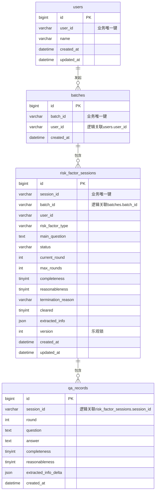

# 风险要素合理怀疑排除服务 — 技术设计方案

## 用户需求

基于 eino 框架（Go, CloudWeGo）构建一个"风险要素合理怀疑排除"服务，整体遵循领域驱动设计（DDD）。批量提交一个用户名下多个风险要素（如身份、资金来源），每个要素含主问题与用户回答；LLM 对每个要素分别判断回答的**完整性**与**合理性**两个独立维度。若信息不完整，则针对缺失点生成追问，等待用户通过专门接口提交追问回答，每要素最多追问 3 次；一旦完整性满足即结束追问循环（不再因合理性问题继续追问），最终结合两个维度给出"是否排除合理怀疑"的结论、终止原因及提取到的结构化信息。

## 产品概览

面向风控/尽调场景：批量提交一个用户名下多个风险要素（如身份、资金来源），每个要素含主问题与用户回答；LLM 对每个要素分别判断回答的**完整性**（信息是否已全部覆盖）与**合理性**（内容是否可信、无矛盾）。若信息不完整，则针对缺失点生成追问，等待用户通过专门接口提交追问回答，每要素最多追问 3 次；一旦完整性满足即结束追问循环（不再因合理性问题继续追问），最终结合两个维度给出"是否排除合理怀疑"的结论、终止原因及提取到的结构化信息。项目升级为**全栈**：后端提供标准化的 HTTP 接口契约（含流式响应能力）、数据层设计；前端提供一个轻量对话页面，用于开发调试上述批量提交/追问问答全流程（非面向最终业务用户的正式产品界面）。

## 核心功能

- 批量提交用户 + 多个风险要素（主问题+回答），各要素独立并发首轮判断
- 单个风险要素追问回答提交接口（按 session 定位，仅 Processing 状态可提交）
- 批次/会话状态与历史问答查询接口
- 完整性驱动追问循环（≤3轮），合理性仅参与终态结论合成、不驱动追问
- 结论合成规则：完整+合理→Cleared；完整+不合理→NotCleared(unreasonable)；达上限仍不完整→NotCleared(max_rounds_incomplete)；不完整且未达上限→继续追问
- 提取信息跨轮次累积合并（同名字段以最新轮次为准）
- 统一的 API 契约：响应包装格式、错误码体系、字段命名规范、鉴权方式
- 全过程持久化，业务状态机作为领域核心知识内聚在领域层，LLM调用与Prompt模板经依赖倒置下沉到基础设施层
- **流式输出**：批量首轮提交、追问回答提交两个触发LLM调用的接口支持以 SSE（Server-Sent Events）方式流式返回LLM生成过程与最终结构化结论，默认仍保留同步JSON响应以兼容既有调用方
- **调试前端**：提供一个简单的单页对话调试页面，可视化发起批量问答、查看/输入追问、观察流式增量输出与最终结论，用于开发期功能验证

## 技术栈

- 语言：Go 1.21+
- LLM框架：CloudWeGo `eino` + `eino-ext`（ChatModel Provider适配，如openai兼容/ark）
- Web框架：Hertz（CloudWeGo同生态，高性能、原生流式支持，errgroup并发调用友好）
- ORM：GORM + golang-migrate（正式迁移脚本）
- 数据库：MySQL 8.x
- 配置：Viper
- 并发：golang.org/x/sync/errgroup
- 流式传输：SSE（`text/event-stream`），Hertz 侧通过 `ctx.SetBodyStreamWriter` 分块写出（或引入 `hertz-contrib/sse`）
- 前端（调试页面）：Vue 3 + TypeScript + Vite（轻量、组件化，便于管理多个风险要素并行对话卡片），开发态通过 Vite Dev Server 代理到后端；不引入状态管理框架/UI组件库，保持调试工具的最小依赖

## 架构风格：DDD + 端口与适配器（Hexagonal）

核心原则：**领域层零框架依赖，业务规则（状态机）内聚在领域层；LLM调用与Prompt构建通过依赖倒置下沉为基础设施层，实现领域层定义的端口接口**。

### 分层说明

- **domain（领域层）**：`internal/domain/riskfactor/`。不 import eino、不 import gorm。包含：
  - 聚合根 `RiskFactorSession`：封装状态机全部规则（转移条件、轮次校验、终态判定、提取信息合并），是"核心领域知识"载体，提供领域方法驱动状态迁移，不对外暴露可绕过规则的字段直接赋值。
  - 值对象：`JudgementResult`（Completeness/Reasonableness/FollowUpQuestion/ExtractedInfo/ReasoningSummary）、`QAPair`、`RiskFactorType`、`SessionStatus`、`TerminationReason` 枚举。
  - 端口（domain定义，infra实现）：`RiskJudger`（LLM判断能力抽象）、`SessionRepository`（持久化能力抽象）。
  - 领域事件（可选，供审计）：`SessionCleared`/`SessionNotCleared`/`FollowUpRequested`。
- **application（应用层）**：`internal/application/`。仅编排：加载聚合→调用`RiskJudger`端口获取判断→调用聚合领域方法完成状态迁移→通过`SessionRepository`端口落库，事务边界在此层控制。不包含业务规则本身。含 `BatchAppService`（批量创建+errgroup并发调度首轮判断）、`SessionAppService`（首次提交/追问提交两个用例）。
- **infra（基础设施层）**：
  - `internal/infra/llm/`：ChatModel工厂（按provider分发eino-ext组件）、Prompt/ChatTemplate构建（系统提示词+风险要素类型+历史问答拼装）、结构化输出Tool Schema定义与解析重试、`JudgerAdapter`实现`domain.RiskJudger`。
  - `internal/infra/persistence/`：GORM实体定义（与domain聚合做双向映射，不直接复用domain结构体）、实现`domain.SessionRepository`（含乐观锁+事务）。
- **api（接口层）**：`internal/api/`。Hertz路由、Handler、DTO，调用application层用例，不下沉业务逻辑；同时承载SSE流式响应的写出（详见"流式输出设计"章节）。
- **config/main**：配置加载 + `cmd/server/main.go` 手动依赖组装（infra实现→注入application→注入api handler），无需额外DI框架。
- **web（前端调试页面）**：`web/`。独立的前端工程（与Go module平级），仅用于开发期功能调试，不属于DDD分层范畴，通过HTTP直接消费api层接口。

依赖方向：api → application → domain(端口接口) ← infra(实现端口)。infra依赖domain定义的接口类型，domain完全不依赖infra，实现依赖倒置。web前端独立于后端分层，仅作为api层的HTTP客户端。

## 判断维度拆分与结论合成（核心业务规则，实现于domain聚合根）

- 每轮LLM判断同时输出 `completeness`（完整性）与`reasonableness`（合理性）两个独立bool，以及`follow_up_question`（针对完整性缺口生成）、`extracted_info`（结构化，跨轮次以字段级合并、同名取最新轮次）。
- 追问循环仅由`completeness`驱动：completeness=false 且 round<3 → 生成追问、round+1、状态仍为Processing；completeness=true → 立即终止追问循环，不再看reasonableness决定是否继续追问。
- 终态结论合成规则（domain聚合根内实现）：
  - completeness=true & reasonableness=true → Cleared（cleared=true）
  - completeness=true & reasonableness=false → NotCleared（cleared=false，reason=unreasonable）
  - completeness=false & round已达3 → NotCleared（cleared=false，reason=max_rounds_incomplete）
  - completeness=false & round<3 → 非终态，继续Processing，携带follow_up_question

## 状态机设计（domain层聚合根RiskFactorSession内实现，非分散在application/api）

状态集合：Processing（含round 0~3）、Cleared（终态）、NotCleared（终态，含reason: unreasonable/max_rounds_incomplete）、LLMError（非终态、可重试、不消耗轮次）。
事件：SubmitInitialAnswer、SubmitFollowUpAnswer、LLM判断返回（携带completeness+reasonableness）、LLM调用/解析失败。

```mermaid
stateDiagram-v2
    [*] --> Processing: SubmitInitialAnswer(round=0)
    Processing --> LLMError: LLM调用/解析失败
    LLMError --> Processing: 重试同一轮(不增加round)
    Processing --> Cleared: completeness=true & reasonableness=true
    Processing --> NotCleared_Unreasonable: completeness=true & reasonableness=false
    Processing --> NotCleared_MaxRounds: completeness=false & round==3
    Processing --> Processing: completeness=false & round<3 (round+=1, 记录follow_up_question, 等待SubmitFollowUpAnswer)
    NotCleared_Unreasonable --> [*]
    NotCleared_MaxRounds --> [*]
    Cleared --> [*]

    state NotCleared_Unreasonable {
      note: cleared=false, reason=unreasonable
    }
    state NotCleared_MaxRounds {
      note: cleared=false, reason=max_rounds_incomplete
    }
```

仅 Processing 状态的session允许提交SubmitFollowUpAnswer；终态session再提交追问请求返回明确业务错误。状态、round、reason、completeness/reasonableness快照等字段在infra/persistence GORM实体中有对应映射，但状态迁移判断逻辑只存在于domain层，infra/application只是读写字段，不做业务判断。

## Implementation Notes

- 日志：不打印用户回答原文全文，仅记录session_id/batch_id/round/status/耗时。
- LLM调用失败/解析失败：进入LLMError，允许同轮重试（不消耗round），最终仍失败需在响应中如实返回错误。
- 批量接口单要素失败不应导致整批失败，返回每要素独立status/error。
- "新增QA记录"与"更新session状态/轮次"须在同一事务内完成（application层控制事务边界，通过SessionRepository端口的事务方法或Unit of Work模式）。
- extracted_info合并逻辑（跨轮次字段级合并）应实现为domain值对象上的方法（如`JudgementResult.MergeInto(existing map)`），保持规则内聚。

## 流式输出设计

### 设计目标与范围

批量首轮提交、追问回答提交两个会触发LLM调用的接口，均需支持**流式输出**：客户端可实时看到LLM推理过程的增量文本，并在流结束时拿到最终的结构化判断结果（completeness/reasonableness/follow_up_question/extracted_info），而不必等待整个LLM调用完成才能看到任何反馈。同步（非流式）JSON响应模式保持不变、继续保留，供不需要流式体验的调用方使用（如批处理脚本）；流式为可选增强，通过请求参数开关。

### 分层影响与依赖倒置的延续

**关键原则：流式仅是"传输/交互体验"层面的能力，不改变domain层的核心契约。** domain聚合根`RiskFactorSession`的状态迁移方法（`SubmitInitialAnswer`/`SubmitFollowUpAnswer`）签名不变，始终只接受一个**完整的、最终的**`JudgementResult`来驱动状态机——状态机不关心判断结果是"一次性拿到"还是"通过流逐步拼装后拿到"。流式能力的落点在 **infra/llm 层**（如何从ChatModel获取流）与 **application/api 层**（如何把这个流转发给HTTP客户端并在流结束后调用domain方法），domain层零改动。

- **domain层**：不变。`RiskJudger`端口新增一个流式方法（见下），但`RiskFactorSession`状态机方法只消费最终`JudgementResult`。
- **infra/llm层**：`JudgerAdapter`基于eino ChatModel的流式调用能力（`Stream()`返回`*schema.StreamReader[*schema.Message]`）拿到token级增量；由于本方案使用Tool/Function Calling绑定结构化输出，工具调用参数（JSON）在流式场景下是分片到达、需要末尾拼接后才能反序列化的，因此实现上：**增量阶段只流式转发模型的"思考/推理"文本片段（用于前端展示"正在分析..."的过程感）；工具调用参数需累积拼接完整后才能反序列化为`JudgementResult`，因此结构化结果只在流的末尾一次性产出**（这是当前主流LLM Function Calling流式场景的通用限制，非本方案独有）。
- **application层**：`SessionAppService`新增`SubmitInitialAnswerStream`/`SubmitFollowUpAnswerStream`用例方法，内部调用`RiskJudger.JudgeStream`拿到事件通道，将增量事件转发给上层（通过回调函数或channel），同时在收到最终事件后，执行与同步路径完全一致的逻辑：调用聚合根状态机方法 + `SessionRepository`持久化，事务边界不变。
- **api层**：Handler 判断请求是否要求流式（见API契约），若是则将响应切换为`text/event-stream`，通过Hertz的`ctx.SetBodyStreamWriter`分块写出SSE事件，每个事件对应`session_id` + 事件类型，供前端按session路由渲染（批量提交场景下，一个HTTP流需承载N个风险要素并发产生的多路事件，靠`session_id`字段多路复用）。

### RiskJudger 端口扩展（新增流式方法，不破坏既有同步方法）

```go
// internal/domain/riskfactor/ports.go
type JudgeStreamEvent struct {
    SessionID string           // 多路复用标识：批量场景下用于区分事件归属的风险要素
    Type      StreamEventType  // "delta"(增量文本) | "judgement"(最终结构化结果) | "error"
    Delta     string           // Type=delta时的文本片段
    Result    *JudgementResult // Type=judgement时的最终结构化结果
    Err       error            // Type=error时的错误
}

type RiskJudger interface {
    Judge(ctx context.Context, riskFactorType RiskFactorType, mainQuestion string, history []QAPair, latestAnswer string) (*JudgementResult, error)
    // JudgeStream 流式版本：通过channel持续产出增量文本，channel关闭前必发出一条Type=judgement或Type=error的终止事件
    JudgeStream(ctx context.Context, sessionID string, riskFactorType RiskFactorType, mainQuestion string, history []QAPair, latestAnswer string) (<-chan JudgeStreamEvent, error)
}
```

### SSE 事件帧格式

统一采用标准 SSE 格式（`Content-Type: text/event-stream`），每条事件：

```
event: delta
data: {"session_id":"sess_abc123","content":"用户提到的职业背景中，任职时间信息尚未提及"}

event: judgement
data: {"session_id":"sess_abc123","status":"processing","current_round":1,"follow_up_question":"您提到的职业背景中，具体的任职时间是？","cleared":null,"termination_reason":null,"extracted_info":{"occupation":"财务经理"}}

event: done
data: {"session_id":"sess_abc123"}
```

- `delta`：增量文本片段，可能多次出现，仅用于前端展示"生成中"的过程感，不含业务结论字段。
- `judgement`：该风险要素本轮的最终结构化结果，字段与同步JSON响应的单项结构完全一致（保证前端可复用同一套渲染逻辑）；每个`session_id`在一次流中只出现一次。
- `done`：该`session_id`的流式片段全部结束的显式标记（批量场景下需要，用于前端判断"这一路的事件不会再来了"，从而更新对应会话卡片状态为"已完成"，即使其它风险要素仍在生成中）。
- `error`：该`session_id`对应的LLM调用/解析失败，`data`含`error_code`/`message`，等价于同步响应中的`status=llm_error`。
- 整个HTTP流在**所有**风险要素（批量场景）都发出`done`或`error`后关闭连接。

### 架构图

```mermaid
graph TB
    Client[客户端/风控业务系统/调试前端]
    subgraph API层
        R1[POST /api/v1/batches 批量首轮提交, 支持stream=true]
        R2[POST /api/v1/sessions/id/answers 追问回答提交, 支持stream=true]
        R3[GET /api/v1/batches/id 批次查询]
        R4[GET /api/v1/sessions/id 会话详情查询]
        SSE[SSE Writer: ctx.SetBodyStreamWriter 分块写出多路复用事件]
    end
    subgraph Application层 用例编排
        BAS[BatchAppService 并发调度]
        SAS[SessionAppService 首轮/追问用例(同步+流式两套), 事务边界]
    end
    subgraph Domain层 核心领域知识
        AGG[RiskFactorSession 聚合根: 状态机+轮次+结论合成规则]
        VO[值对象: JudgementResult/QAPair/SessionStatus]
        P1[[端口: RiskJudger Judge/JudgeStream]]
        P2[[端口: SessionRepository]]
    end
    subgraph Infra层 端口实现 依赖倒置
        LLMA[JudgerAdapter: ChatModel工厂+Prompt模板+Tool Schema解析+流式转发]
        PERSA[GORM Repository: 实体映射+乐观锁+事务]
    end
    DB[(MySQL: users/batches/risk_factor_sessions/qa_records)]

    Client --> R1 --> BAS
    Client --> R2 --> SAS
    Client --> R3 --> SAS
    Client --> R4 --> SAS
    R1 -.流式.-> SSE
    R2 -.流式.-> SSE
    SSE -.事件转发.-> Client
    BAS --> SAS
    SAS --> AGG
    AGG --> VO
    SAS -.调用.-> P1
    SAS -.调用.-> P2
    LLMA -.实现.-> P1
    PERSA -.实现.-> P2
    PERSA --> DB
```

## API 接口文档（契约设计）

### 统一规范

- **统一响应包装**：采用"HTTP 状态码表达调用层面的成功/失败 + 业务对象直接作为响应体"的方案（不额外套 code/message/data 包装），理由：本服务是纯后端API、无需兼容遗留统一网关协议；HTTP状态码本身已能表达是否成功（2xx/4xx/5xx），业务对象直接返回可减少一层嵌套解析，前端/调用方按状态码分流处理更直观；批量接口内单项失败通过响应体内每项独立的 `status`/`error` 字段表达，而非依赖外层 code。若后续需接入统一网关规范，可在api层加一层薄包装，不影响application/domain。
- **错误响应统一结构**（4xx/5xx 场景）：

```json
{
  "error_code": "SESSION_NOT_PROCESSING",
  "message": "session当前状态为cleared，不允许提交追问回答",
  "request_id": "req-xxxx"
}
```

- **字段命名规范**：全部使用 snake_case，与Go结构体 `json:"xxx_yyy"` tag 一一对应；时间字段统一 ISO8601 字符串（如 `2026-07-23T10:00:00Z`）；枚举字段使用小写下划线字符串（如 `risk_factor_type: "identity"` / `"fund_source"`；`status: "processing"|"cleared"|"not_cleared"|"llm_error"`；`termination_reason: "unreasonable"|"max_rounds_incomplete"`）。
- **鉴权方式**：当前阶段服务定位为内部风控系统间调用，无需完整用户登录体系，采用简单 API Key 鉴权：请求头 `X-API-Key: <key>`，由 api 层中间件统一校验，未通过返回 `401 UNAUTHORIZED`；后续如需更细粒度权限控制，可在此中间件位置扩展，不影响下层设计。
- **流式响应触发方式**：请求体新增可选字段 `stream`（bool，默认`false`）。`stream=false`（默认）走原有同步JSON响应；`stream=true`时，响应`Content-Type`变为`text/event-stream`，按"流式输出设计"章节的SSE事件帧格式返回，HTTP状态码仍为200（若鉴权失败等前置校验错误，则在建立流之前以标准JSON错误响应返回，不进入流模式）。

### 错误码与 HTTP 状态码映射表

| error_code | HTTP状态码 | 场景 |
| --- | --- | --- |
| INVALID_PARAM | 400 | 请求参数校验失败（缺失字段、枚举值非法等） |
| UNAUTHORIZED | 401 | API Key 缺失或无效 |
| SESSION_NOT_FOUND | 404 | session_id 不存在 |
| BATCH_NOT_FOUND | 404 | batch_id 不存在 |
| SESSION_NOT_PROCESSING | 409 | 对非Processing状态的session提交追问回答 |
| LLM_JUDGE_FAILED | 502 | LLM调用/结构化输出解析最终失败（重试后仍失败） |
| INTERNAL_ERROR | 500 | 未预期的内部错误（如DB写入异常） |

### 1. POST /api/v1/batches — 批量首轮提交

请求体：

```json
{
  "user": { "user_id": "u_1001", "name": "张三" },
  "risk_factors": [
    {
      "risk_factor_type": "identity",
      "main_question": "请说明您的身份信息及职业背景",
      "answer": "我是XX公司的财务经理..."
    },
    {
      "risk_factor_type": "fund_source",
      "main_question": "请说明本次资金的来源",
      "answer": "资金来源于..."
    }
  ],
  "stream": false
}
```

字段说明：`user.user_id`必填；`risk_factors`数组，每项`risk_factor_type`（枚举：identity/fund_source等，可扩展）、`main_question`、`answer`均必填，为空则返回`INVALID_PARAM`；`stream`可选，默认`false`，为`true`时以SSE流式返回（见下）。

响应体（`stream=false`，HTTP 200，单要素失败不影响整批）：

```json
{
  "batch_id": "batch_20260723_001",
  "created_at": "2026-07-23T10:00:00Z",
  "results": [
    {
      "session_id": "sess_abc123",
      "risk_factor_type": "identity",
      "status": "processing",
      "current_round": 1,
      "follow_up_question": "您提到的职业背景中，具体的任职时间是？",
      "cleared": null,
      "termination_reason": null,
      "extracted_info": {"occupation": "财务经理"},
      "error": null
    },
    {
      "session_id": "sess_def456",
      "risk_factor_type": "fund_source",
      "status": "cleared",
      "current_round": 0,
      "follow_up_question": null,
      "cleared": true,
      "termination_reason": null,
      "extracted_info": {"source": "工资收入"},
      "error": null
    }
  ]
}
```

说明：`status=llm_error`时`error`字段携带`error_code`+`message`，其余字段可为空；该项失败不影响其他风险要素的正常返回。

响应体（`stream=true`，`Content-Type: text/event-stream`）：批量场景下多个风险要素的事件在**同一条HTTP流**中按各自LLM调用完成的先后顺序交错到达，前端依赖每个事件的`session_id`字段分流渲染到对应会话卡片，格式详见"流式输出设计"章节的SSE事件帧说明。示例片段：

```
event: delta
data: {"session_id":"sess_abc123","content":"正在分析身份信息的完整性..."}

event: judgement
data: {"session_id":"sess_def456","risk_factor_type":"fund_source","status":"cleared","current_round":0,"follow_up_question":null,"cleared":true,"termination_reason":null,"extracted_info":{"source":"工资收入"}}

event: done
data: {"session_id":"sess_def456"}

event: judgement
data: {"session_id":"sess_abc123","risk_factor_type":"identity","status":"processing","current_round":1,"follow_up_question":"您提到的职业背景中，具体的任职时间是？","cleared":null,"termination_reason":null,"extracted_info":{"occupation":"财务经理"}}

event: done
data: {"session_id":"sess_abc123"}
```

### 2. POST /api/v1/sessions/{session_id}/answers — 追问回答提交

路径参数：`session_id`

请求体：

```json
{ "answer": "任职时间为2020年至今", "stream": false }
```

`stream`字段含义与用法同上，可选，默认`false`。

响应体（`stream=false`，HTTP 200）：

```json
{
  "session_id": "sess_abc123",
  "status": "cleared",
  "current_round": 1,
  "follow_up_question": null,
  "cleared": true,
  "termination_reason": null,
  "extracted_info": {"occupation": "财务经理", "tenure": "2020年至今"},
  "error": null
}
```

响应体（`stream=true`，`Content-Type: text/event-stream`，单session单路事件）：

```
event: delta
data: {"session_id":"sess_abc123","content":"任职时间信息已补充完整，正在核对合理性..."}

event: judgement
data: {"session_id":"sess_abc123","status":"cleared","current_round":1,"follow_up_question":null,"cleared":true,"termination_reason":null,"extracted_info":{"occupation":"财务经理","tenure":"2020年至今"}}

event: done
data: {"session_id":"sess_abc123"}
```

校验规则：`session_id`不存在 → `404 SESSION_NOT_FOUND`；session非`processing`状态提交 → `409 SESSION_NOT_PROCESSING`；`answer`为空 → `400 INVALID_PARAM`（流式模式下同样在建立流之前做前置校验，校验失败仍返回标准JSON错误响应，不建立SSE连接）。

### 3. GET /api/v1/batches/{batch_id} — 批次查询

响应体（HTTP 200）：

```json
{
  "batch_id": "batch_20260723_001",
  "created_at": "2026-07-23T10:00:00Z",
  "sessions": [
    {
      "session_id": "sess_abc123",
      "risk_factor_type": "identity",
      "main_question": "请说明您的身份信息及职业背景",
      "status": "cleared",
      "current_round": 1,
      "max_rounds": 3,
      "cleared": true,
      "termination_reason": null,
      "extracted_info": {"occupation": "财务经理", "tenure": "2020年至今"},
      "history": [
        {"round": 0, "question": "请说明您的身份信息及职业背景", "answer": "我是XX公司的财务经理...", "completeness": false, "reasonableness": true},
        {"round": 1, "question": "您提到的职业背景中，具体的任职时间是？", "answer": "任职时间为2020年至今", "completeness": true, "reasonableness": true}
      ]
    }
  ]
}
```

`batch_id`不存在 → `404 BATCH_NOT_FOUND`。

### 4. GET /api/v1/sessions/{session_id} — 会话详情查询

响应体结构同上"sessions"数组中单项，直接返回该session完整详情（含`history`数组）。`session_id`不存在 → `404 SESSION_NOT_FOUND`。

## 数据层设计

### ER 关系图



### 外键约束设计决策

**不使用数据库外键约束**，仅通过业务标识字段（`user_id`/`batch_id`/`session_id`，均为应用层生成的字符串ID，如UUID或自定义前缀+时间戳）+ 索引维护引用完整性，理由：

- 避免分布式/多实例部署下因外键约束产生的锁竞争，批量接口内并发写多个 `risk_factor_sessions`/`qa_records` 时可获得更好的写入吞吐；
- 便于后续分库分表、数据归档迁移，不受外键强约束限制；
- 引用完整性由 application 层（事务内先写父表再写子表）与领域规则保证，数据库侧通过索引保障查询性能。

### 字符集与引擎

统一使用 `utf8mb4` 字符集（支持中文及emoji）、`InnoDB` 引擎（支持事务，与"QA记录写入+session状态更新同事务"的设计吻合）。

### 建表 DDL（`migrations/0001_init_schema.up.sql`）

执行顺序：`users` → `batches` → `risk_factor_sessions` → `qa_records`（无外键约束，此顺序仅为可读性考虑，非强制依赖）。

```sql
CREATE TABLE `users` (
  `id` BIGINT UNSIGNED NOT NULL AUTO_INCREMENT,
  `user_id` VARCHAR(64) NOT NULL COMMENT '业务用户唯一标识',
  `name` VARCHAR(128) DEFAULT NULL COMMENT '用户姓名',
  `created_at` DATETIME NOT NULL DEFAULT CURRENT_TIMESTAMP,
  `updated_at` DATETIME NOT NULL DEFAULT CURRENT_TIMESTAMP ON UPDATE CURRENT_TIMESTAMP,
  PRIMARY KEY (`id`),
  UNIQUE KEY `uk_user_id` (`user_id`)
) ENGINE=InnoDB DEFAULT CHARSET=utf8mb4 COLLATE=utf8mb4_0900_ai_ci COMMENT='用户表';

CREATE TABLE `batches` (
  `id` BIGINT UNSIGNED NOT NULL AUTO_INCREMENT,
  `batch_id` VARCHAR(64) NOT NULL COMMENT '业务批次唯一标识',
  `user_id` VARCHAR(64) NOT NULL COMMENT '逻辑关联users.user_id，不设外键',
  `created_at` DATETIME NOT NULL DEFAULT CURRENT_TIMESTAMP,
  PRIMARY KEY (`id`),
  UNIQUE KEY `uk_batch_id` (`batch_id`),
  KEY `idx_user_id` (`user_id`)
) ENGINE=InnoDB DEFAULT CHARSET=utf8mb4 COLLATE=utf8mb4_0900_ai_ci COMMENT='批次表';

CREATE TABLE `risk_factor_sessions` (
  `id` BIGINT UNSIGNED NOT NULL AUTO_INCREMENT,
  `session_id` VARCHAR(64) NOT NULL COMMENT '业务会话唯一标识',
  `batch_id` VARCHAR(64) NOT NULL COMMENT '逻辑关联batches.batch_id，不设外键',
  `user_id` VARCHAR(64) NOT NULL COMMENT '便于按用户查询',
  `risk_factor_type` VARCHAR(32) NOT NULL COMMENT '风险要素类型：identity/fund_source等',
  `main_question` TEXT NOT NULL COMMENT '主问题内容',
  `status` VARCHAR(32) NOT NULL DEFAULT 'processing' COMMENT 'processing/cleared/not_cleared/llm_error',
  `current_round` INT NOT NULL DEFAULT 0 COMMENT '当前已完成轮次，0~3',
  `max_rounds` INT NOT NULL DEFAULT 3 COMMENT '最大追问轮次',
  `completeness` TINYINT(1) DEFAULT NULL COMMENT '最新一轮完整性判断快照',
  `reasonableness` TINYINT(1) DEFAULT NULL COMMENT '最新一轮合理性判断快照',
  `termination_reason` VARCHAR(32) DEFAULT NULL COMMENT 'unreasonable/max_rounds_incomplete，终态才有值',
  `cleared` TINYINT(1) DEFAULT NULL COMMENT '是否排除合理怀疑，终态才有值',
  `extracted_info` JSON DEFAULT NULL COMMENT '跨轮次累积合并后的结构化提取信息',
  `version` INT NOT NULL DEFAULT 0 COMMENT '乐观锁版本号',
  `created_at` DATETIME NOT NULL DEFAULT CURRENT_TIMESTAMP,
  `updated_at` DATETIME NOT NULL DEFAULT CURRENT_TIMESTAMP ON UPDATE CURRENT_TIMESTAMP,
  PRIMARY KEY (`id`),
  UNIQUE KEY `uk_session_id` (`session_id`),
  KEY `idx_batch_id` (`batch_id`),
  KEY `idx_user_id` (`user_id`),
  KEY `idx_status` (`status`)
) ENGINE=InnoDB DEFAULT CHARSET=utf8mb4 COLLATE=utf8mb4_0900_ai_ci COMMENT='风险要素会话表';

CREATE TABLE `qa_records` (
  `id` BIGINT UNSIGNED NOT NULL AUTO_INCREMENT,
  `session_id` VARCHAR(64) NOT NULL COMMENT '逻辑关联risk_factor_sessions.session_id，不设外键',
  `round` INT NOT NULL COMMENT '该轮次序号，0为主问题，1~3为追问',
  `question` TEXT NOT NULL COMMENT '本轮问题内容（主问题或追问）',
  `answer` TEXT NOT NULL COMMENT '用户本轮回答',
  `completeness` TINYINT(1) DEFAULT NULL COMMENT '本轮完整性判断快照',
  `reasonableness` TINYINT(1) DEFAULT NULL COMMENT '本轮合理性判断快照',
  `extracted_info_delta` JSON DEFAULT NULL COMMENT '本轮新提取到的增量信息，用于审计追溯',
  `created_at` DATETIME NOT NULL DEFAULT CURRENT_TIMESTAMP,
  PRIMARY KEY (`id`),
  UNIQUE KEY `uk_session_round` (`session_id`, `round`),
  KEY `idx_session_id` (`session_id`)
) ENGINE=InnoDB DEFAULT CHARSET=utf8mb4 COLLATE=utf8mb4_0900_ai_ci COMMENT='问答记录表';
```

### 回滚脚本（`migrations/0001_init_schema.down.sql`）

按依赖反序删除：

```sql
DROP TABLE IF EXISTS `qa_records`;
DROP TABLE IF EXISTS `risk_factor_sessions`;
DROP TABLE IF EXISTS `batches`;
DROP TABLE IF EXISTS `users`;
```

## 前端调试页面设计

### 定位与目标

前端仅作为**开发调试工具**，用于人肉验证批量提交/追问循环/流式输出/状态机结论等后端能力是否符合预期，不追求生产级视觉与交互完整度，不涉及用户登录、权限管理等业务功能；直接以简单表单+对话卡片形式暴露后端已有接口能力。

### 技术选型

- Vue 3 + `<script setup>` + TypeScript + Vite：搭建成本低、无需引入路由/状态管理等重型依赖；原生 `fetch` + `ReadableStream`（或 `EventSource`，见下方取舍说明）即可满足调试需求。
- 不引入 UI 组件库，使用最基础的原生表单元素+少量CSS，减少依赖体积与学习成本，符合"调试工具"定位。
- 与后端解耦部署：开发态通过 Vite Dev Server 的 `server.proxy` 将 `/api` 转发到本地 Hertz 服务（默认 `:8080`）；构建后的静态产物也可选择性地由 Hertz 通过 `internal/api/router.go` 挂载的静态文件Handler直接托管（`/`路径），实现单进程一体化调试部署（可选，不强制）。

### SSE 客户端实现方式的选择

原生浏览器 `EventSource` 只支持 GET 请求，而本方案的流式接口均为 POST（批量提交/追问回答提交的请求体较复杂，不适合塞进 query string），因此前端**不使用 `EventSource`**，改为：`fetch(url, {method:'POST', body, headers})` 拿到 `Response.body`（`ReadableStream`），自行按 SSE 文本协议（`event:`/`data:`空行分隔）解析每一帧，兼容性好且不受GET限制。

### 页面功能

单页面，核心区域：

1. **发起表单**：录入 `user_id`/`name`，动态增减多个风险要素卡片（每卡片含`risk_factor_type`下拉、`main_question`、`answer`文本框），底部"是否流式输出"开关，提交后调用 `POST /api/v1/batches`。
2. **会话卡片列表**：批量提交后按返回的每个`session_id`渲染一张会话卡片，卡片内容：风险要素类型、当前状态徽标（processing/cleared/not_cleared/llm_error，用不同颜色区分）、历史问答时间线（每轮`question`/`answer`及`completeness`/`reasonableness`快照标签）、若`status=processing`则显示`follow_up_question`与一个追问回答输入框+提交按钮（调用 `POST /api/v1/sessions/{id}/answers`）。
3. **流式增量展示**：当开启流式，会话卡片内增加一块"生成过程"区域，实时追加显示收到的`delta`事件文本（打字机效果可选），收到`judgement`事件后将该区域折叠、正式渲染结构化结论并结束该卡片的"生成中"状态（对应`done`事件）；收到`error`事件则将卡片状态置为`llm_error`并展示错误信息。
4. **批次/会话查询**：提供一个输入框可粘贴`batch_id`调用 `GET /api/v1/batches/{id}` 重新拉取整批状态（用于刷新页面后恢复调试上下文），无需完整路由体系。

### 目录结构（前端工程，独立于Go module）

```
web/
├── index.html
├── vite.config.ts                # 配置 server.proxy 转发 /api/* 到本地Hertz服务
├── package.json
├── tsconfig.json
└── src/
    ├── main.ts
    ├── App.vue                   # 页面主体：发起表单+会话卡片列表+批次查询入口
    ├── api/
    │   └── client.ts             # 封装批量提交/追问提交(含stream参数)/批次查询/会话查询的HTTP调用；流式请求内自行解析SSE文本帧
    ├── components/
    │   ├── RiskFactorForm.vue    # 发起表单：用户信息+动态风险要素卡片编辑
    │   ├── SessionCard.vue       # 单个会话卡片：状态徽标、历史问答时间线、追问输入框、流式生成过程展示区
    │   └── StatusBadge.vue       # 状态徽标小组件（processing/cleared/not_cleared/llm_error配色）
    └── types.ts                  # 与后端DTO对应的TS类型定义（BatchResponse/SessionResult/SSE事件类型等）
```

## Directory Structure Summary

全新全栈项目：后端按DDD分层组织：domain（领域规则）、application（用例编排）、infra（LLM与持久化适配器，依赖倒置实现domain端口）、api（Hertz接口层，按上述接口文档实现，含SSE流式写出）、config、迁移脚本；前端`web/`目录为独立的Vue调试工程，通过HTTP消费后端接口，两者以`eino-risk-qa/`为项目根目录并列存在。

```
eino-risk-qa/
├── cmd/
│   └── server/
│       └── main.go                          # 依赖组装：加载配置→构造infra实现(JudgerAdapter/GORMSessionRepository)→注入application service→注入api handler→注册路由(含API Key中间件)→启动Hertz
├── internal/
│   ├── domain/
│   │   └── riskfactor/
│   │       ├── session.go                   # 聚合根RiskFactorSession：状态机全部规则(SubmitInitialAnswer/SubmitFollowUpAnswer方法)，round校验，终态判定与结论合成(Cleared/NotCleared+reason)
│   │       ├── judgement.go                 # 值对象JudgementResult(Completeness/Reasonableness/FollowUpQuestion/ExtractedInfo/ReasoningSummary)及ExtractedInfo跨轮次合并方法MergeInto
│   │       ├── qa_pair.go                   # 值对象QAPair(问题/回答/所属轮次/completeness/reasonableness判断快照)
│   │       ├── types.go                     # SessionStatus、TerminationReason、RiskFactorType枚举定义
│   │       ├── events.go                    # 领域事件定义(SessionCleared/SessionNotCleared/FollowUpRequested)，用于审计扩展
│   │       └── ports.go                     # 端口接口定义：RiskJudger(Judge方法)、SessionRepository(Save/FindByID/事务方法)，domain层核心抽象，infra实现，application依赖注入使用
│   ├── application/
│   │   ├── batch_app_service.go             # BatchAppService：创建batch，errgroup并发调度各风险要素调用SessionAppService.SubmitInitial
│   │   └── session_app_service.go           # SessionAppService：SubmitInitial/SubmitFollowUp两个用例，加载聚合→调用RiskJudger端口→调用聚合领域方法→SessionRepository端口持久化，事务边界控制
│   ├── infra/
│   │   ├── llm/
│   │   │   ├── factory.go                   # ChatModel工厂：按config.Provider(openai/ark)分发eino-ext组件，返回ToolCallingChatModel接口
│   │   │   ├── prompt.go                    # Prompt/ChatTemplate构建：系统提示词、风险要素类型、历史问答拼装、完整性/合理性判断指引
│   │   │   ├── schema.go                    # 结构化输出Tool Schema定义(completeness/reasonableness/follow_up_question/extracted_info/reasoning_summary)
│   │   │   ├── judger_adapter.go            # JudgerAdapter实现domain.RiskJudger端口：组合factory+prompt+schema，含重试与解析失败处理
│   │   │   └── stream_adapter.go            # JudgerAdapter的JudgeStream实现：基于eino ChatModel.Stream()转发delta文本，累积拼接ToolCall参数后产出最终judgement事件
│   │   └── persistence/
│   │       ├── models.go                    # GORM实体：UserModel/BatchModel/RiskFactorSessionModel(含completeness/reasonableness快照、reason、round、version乐观锁字段)/QARecordModel
│   │       ├── session_repository.go        # GORMSessionRepository实现domain.SessionRepository：Save(事务内同时写session状态与QA记录)、FindByID，乐观锁条件更新
│   │       └── mapper.go                    # domain聚合 <-> GORM实体的双向映射转换函数，避免domain直接依赖gorm tag
│   ├── api/
│   │   ├── router.go                        # Hertz路由注册：/api/v1/batches、/api/v1/sessions/:id/answers、/api/v1/batches/:id、/api/v1/sessions/:id，挂载API Key鉴权中间件
│   │   ├── middleware/
│   │   │   └── auth.go                      # API Key校验中间件，读取X-API-Key头，未通过返回401 UNAUTHORIZED
│   │   ├── handler/
│   │   │   ├── batch_handler.go             # 批量提交/批次查询接口处理，调用BatchAppService，按文档组装results数组响应；stream=true时切换SSE写出
│   │   │   └── session_handler.go           # 追问提交/会话查询接口处理，调用SessionAppService，统一错误码转换(404/409/400/502/500)；stream=true时切换SSE写出
│   │   └── dto/
│   │       ├── batch_dto.go                 # 批量提交请求/响应结构体(BatchRequest/BatchResponse/SessionResult)，json tag对应接口文档字段，含stream字段
│   │       ├── session_dto.go               # 追问提交请求/响应、查询响应结构体(SessionDetailResponse含history)，含completeness/reasonableness/reason字段，含stream字段
│   │       └── sse_dto.go                   # SSE事件帧结构体(delta/judgement/done/error)及序列化为SSE文本帧的辅助方法
│   └── config/
│       └── config.go                        # Viper配置：Server/MySQL DSN/LLM Provider鉴权/最大追问轮次/API Key值
├── migrations/
│   ├── 0001_init_schema.up.sql              # 建表：users/batches/risk_factor_sessions(含completeness/reasonableness/reason/round/version字段)/qa_records
│   └── 0001_init_schema.down.sql            # 回滚脚本
├── configs/
│   └── config.yaml                          # 默认配置样例(含api_key占位)
├── go.mod / go.sum                          # 依赖：eino、eino-ext、hertz、gorm、mysql driver、viper、errgroup
├── web/                                      # 前端调试工程（详见"前端调试页面设计"章节的目录结构）
└── README.md                                # 项目说明、DDD分层说明、完整API接口文档(含请求/响应示例、错误码表、流式说明)、启动方式（含前后端联调步骤）
```

## Key Code Structures

```go
// internal/domain/riskfactor/ports.go — 依赖倒置的核心端口，domain定义、infra实现
type RiskJudger interface {
    Judge(ctx context.Context, riskFactorType RiskFactorType, mainQuestion string, history []QAPair, latestAnswer string) (*JudgementResult, error)
    // JudgeStream 流式版本：详见"流式输出设计"章节，channel关闭前必发出judgement或error事件
    JudgeStream(ctx context.Context, sessionID string, riskFactorType RiskFactorType, mainQuestion string, history []QAPair, latestAnswer string) (<-chan JudgeStreamEvent, error)
}

type SessionRepository interface {
    Save(ctx context.Context, session *RiskFactorSession) error // 事务内同时持久化session状态与新增QA记录
    FindByID(ctx context.Context, sessionID string) (*RiskFactorSession, error)
}
```

```go
// internal/domain/riskfactor/judgement.go — 判断结果值对象，完整性驱动追问、合理性参与结论合成
type JudgementResult struct {
    Completeness     bool
    Reasonableness   bool
    FollowUpQuestion string                 // 仅Completeness=false时有效，针对完整性缺口生成
    ExtractedInfo    map[string]interface{}
    ReasoningSummary string
}

// MergeInto 将本轮提取信息与历史累积信息合并，同名字段以最新轮次为准
func (j *JudgementResult) MergeInto(existing map[string]interface{}) map[string]interface{}
```

```go
// internal/domain/riskfactor/session.go — 聚合根，状态机核心领域方法签名
type RiskFactorSession struct {
    ID, BatchID, UserID string
    RiskFactorType       RiskFactorType
    MainQuestion         string
    Status                SessionStatus // Processing | Cleared | NotCleared | LLMError
    CurrentRound          int           // 0~3
    MaxRounds             int           // 默认3
    TerminationReason     *TerminationReason // unreasonable | max_rounds_incomplete
    ExtractedInfo         map[string]interface{}
    History               []QAPair
}

// SubmitInitialAnswer 首轮主问题回答提交，内部调用judgement驱动状态迁移
func (s *RiskFactorSession) SubmitInitialAnswer(answer string, judgement *JudgementResult) error
// SubmitFollowUpAnswer 追问回答提交，仅Processing状态允许调用，内部执行完整性驱动的追问循环与结论合成规则
func (s *RiskFactorSession) SubmitFollowUpAnswer(answer string, judgement *JudgementResult) error
```
